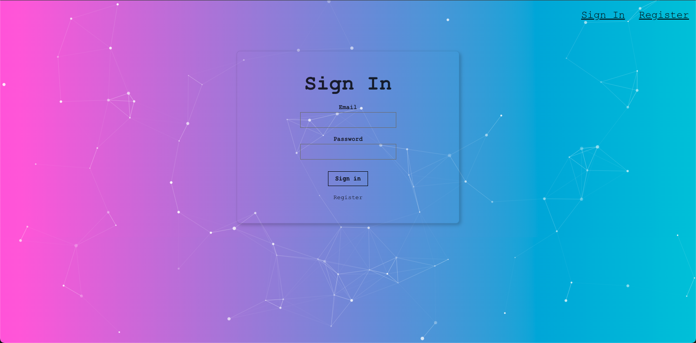
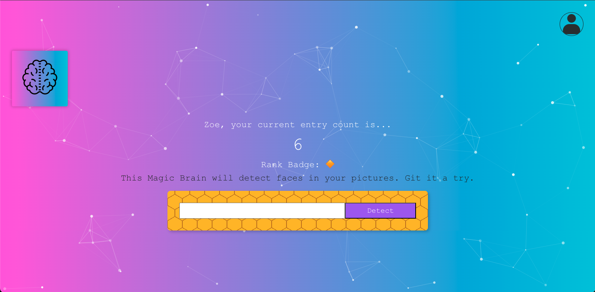
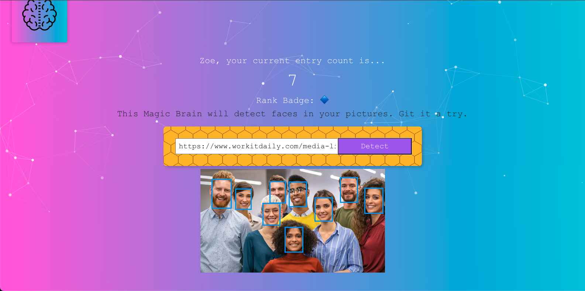
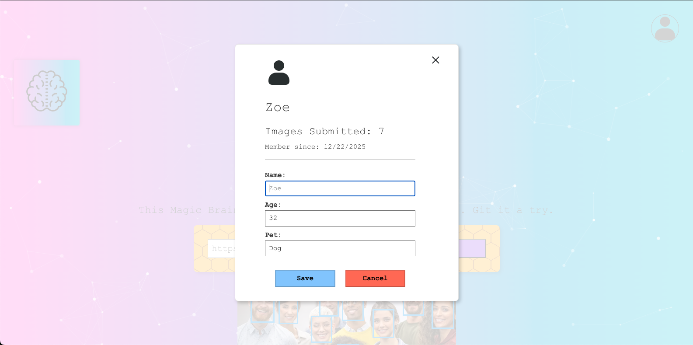

# Face Recognition Brain App (Frontend)

Face Recognition Brain is a full-stack face recognition web application that allows users to register, authenticate, and perform AI-powered face detection on images. Authenticated users can manage their profiles, submit image URLs for face detection, and track their usage through a ranking system.

This repository contains the **frontend application**, built with React.

---

## 🌐 Live Demo

🔗 https://facerecognitionbrain-frontend.onrender.com

Demo account credentials:

- Email: demo@example.com
- Password: demo123

---

## 📸 Screenshots

Screenshots below show the main user flows of the application.

### Sign In



### Face Detection Dashboard



### Face Detection Result



### Profile Update



---

## 🧩 Project Architecture

This project is intentionally split into three independent services:

- **Frontend (this repo)** – React web application
- **Backend API** – Node.js + Express REST API
- **Serverless Function** – AWS Lambda for rank badge calculation

This structure demonstrates separation of concerns, scalability, and real-world cloud deployment patterns.

---

## 🔄 System Interaction

The frontend acts as the primary user interface and coordinates communication between multiple services:

- **Backend API**

  - Handles authentication, user profiles, face detection requests, and entry count persistence
  - Receives JWTs via Authorization headers for protected routes

- **AWS Lambda (Rank Badge Service)**
  - Invoked directly by the frontend
  - Converts user entry counts into visual rank badges (emoji)
  - Offloads non-critical logic from the backend to demonstrate a serverless-first design

This separation enables better scalability, reduced backend load, and clear responsibility boundaries between services.

---

## 🔗 Related repositories:

- 🔗 Backend API: https://github.com/ahung1709/facerecognitionbrain-api

  User authentication, image submission, and UI rendering

- 🔗 AWS Lambda (Rank Badge): https://github.com/ahung1709/rankly

  A lightweight serverless function that converts a user’s face-detection entry count into a visual rank badge (emoji)

---

## 🛠 Tech Stack (Frontend)

- React (Create React App)
- JavaScript (ES6+)
- Reactstrap
- Bootstrap
- Tachyons
- JWT-based authentication
- Fetch API

---

## 🔐 Authentication Flow

- Users register or sign in via the backend API
- A JWT is issued by the backend
- JWT is stored in `sessionStorage`
- Authenticated requests include the JWT in request headers

---

## 🤖 Face Detection Flow

1. User submits an image URL
2. Frontend sends request to backend
3. Backend calls Clarifai API for face detection
4. Bounding boxes are returned and rendered on the image
5. Entry count is updated and displayed
6. Rank badge is fetched directly from AWS Lambda (serverless service)

---

## ⚙️ Environment Variables

### Local development

The frontend relies on environment variables to communicate with backend services.

Create a `.env` file in the project root:

```env
REACT_APP_API_URL=http://localhost:3001
REACT_APP_SERVERLESS_BASE_URL=https://<lambda-url>
```

> A single `.env` file is sufficient for local development.  
> `.env.development` is optional and not required.

### Deployment

The frontend is deployed as a static site on Render.
Environment variables are injected at build time.

```env
REACT_APP_API_URL=https://facerecognitionbrain-api-ulce.onrender.com
REACT_APP_SERVERLESS_BASE_URL=https://<lambda-url>
```

---

## 🚀 Getting Started (Local Development)

### Prerequisites

- Node.js (v18+ recommended)
- npm (comes with Node.js)

> Note: This project uses npm.  
> Using Yarn may result in different dependency resolutions.

### Setup

```bash
npm install
npm run dev
```
